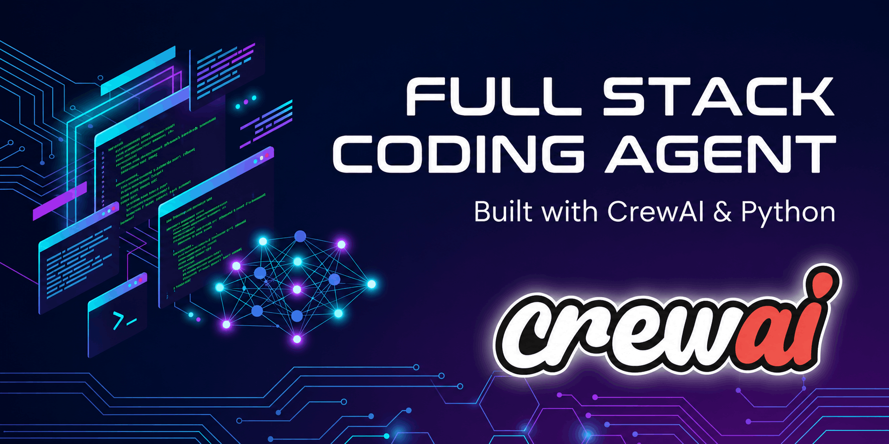

<p align="center">
  
</p>

<p align="center"><em>Codrr: CrewAI-powered Full Stack Project Generator</em></p>

Codrr is a CrewAI-powered agent that turns natural-language requirements into complete projects. Describe what you want to build, and a **Senior Full Stack Developer** agent generates the files and saves them to `output/`.

## Sample Run

This walkthrough uses the prompt:

```text
Build a simple HTML Page for Sarvan Kumar He is a fullstack dev
```

Run the agent with `python run.py`, paste the prompt above, and you should see output similar to the screenshots below.

---

## 1. Enter Your Requirement

The crew picks up your prompt and starts the task with the full generation instructions.

<p align="center">
  
</p>

<p align="center"><em>Figure 1: User enters a project requirement and the crew begins execution.</em></p>

---

## 2. Agent Starts Working

The **Senior Full Stack Developer** agent receives the task and begins calling the **File Writer** tool. First file: `index.html`.

<p align="center">
  
</p>

<p align="center"><em>Figure 2: The agent begins generating project files.</em></p>

---

## 3. More Files Are Written

The agent continues generating project files including `styles.css`, `package.json`, `requirements.txt`, and `README.md`.

<p align="center">
  
</p>

<p align="center"><em>Figure 3: Additional files are generated through File Writer tool calls.</em></p>

---

## 4. Tools Complete Successfully

Each tool call confirms the file was saved under `output/`.

<p align="center">
  
</p>

<p align="center"><em>Figure 4: Generated files are successfully written to disk.</em></p>

---

## 5. Agent Final Answer

The agent summarizes what was created:

| File               | Description                           |
| ------------------ | ------------------------------------- |
| `index.html`       | Portfolio page                        |
| `styles.css`       | Styles                                |
| `package.json`     | Project metadata (`sarvan-portfolio`) |
| `requirements.txt` | Dependency file                       |
| `README.md`        | Generated project readme              |

<p align="center">
  
</p>

<p align="center"><em>Figure 5: The agent provides a summary of generated files.</em></p>

---

## 6. Task And Crew Complete

Execution finishes and the script prints the success message.

<p align="center">
  
</p>

<p align="center"><em>Figure 6: Crew execution completes successfully.</em></p>

---

## 7. Generated Output

<p align="center">
  
</p>

<p align="center"><em>Figure 7: Final generated website output.</em></p>

Generated files land in:

```text
output/
├── index.html
├── styles.css
├── package.json
├── requirements.txt
└── README.md
```

## How It Works

```text
User Requirement
        ↓
Crew (Agent + Task)
        ↓
LLM (OpenRouter)
        ↓
FileWriterTool
        ↓
output/
```

1. You enter a project requirement at the prompt.
2. A task is created with production-ready coding rules.
3. The coder agent plans the project and writes files through the File Writer tool.
4. When the crew finishes, the project is available in `output/`.

## Quick Start

### Prerequisites

* Python 3.10+
* An OpenRouter API key

### Install

```bash
cd agents
python -m venv .venv

# Windows
.venv\Scripts\activate

# macOS / Linux
source .venv/bin/activate

pip install -r requirements.txt
```

### Configure

Create a `.env` file:

```env
OPENROUTER_API_KEY=your_openrouter_api_key_here
MODEL=openrouter/openai/gpt-4o-mini
BASE_URL=https://openrouter.ai/api/v1
TEMPERATURE=0.2
```

### Run

```bash
python run.py
```

## Project Structure

```text
agents/
├── run.py
├── agents.py
├── tasks.py
├── tools.py
├── assets/
├── requirements.txt
├── .env
└── output/
```

## Customization

* Change model via `.env`
* Adjust agent behavior in `agents.py`
* Modify generation rules in `tasks.py`
* Add new tools in `tools.py`

## Dependencies

* CrewAI
* crewai_tools
* LiteLLM
* python-dotenv

## Troubleshooting

* Authentication errors → Verify API key.
* Empty output → Use a better model or more detailed prompt.
* Files not saved → Ensure File Writer tool is called.

## License

> MIT License
>
> Copyright (c) 2026 full-stack-coding-agent
>
> Permission is hereby granted, free of charge, to any person obtaining a copy of this software and associated documentation files (the "Software"), to deal in the Software without restriction, including without limitation the rights to use, copy, modify, merge, publish, distribute, sublicense, and/or sell copies of the Software, and to permit persons to whom the Software is furnished to do so, subject to the following conditions:
>
> The above copyright notice and this permission notice shall be included in all copies or substantial portions of the Software.
