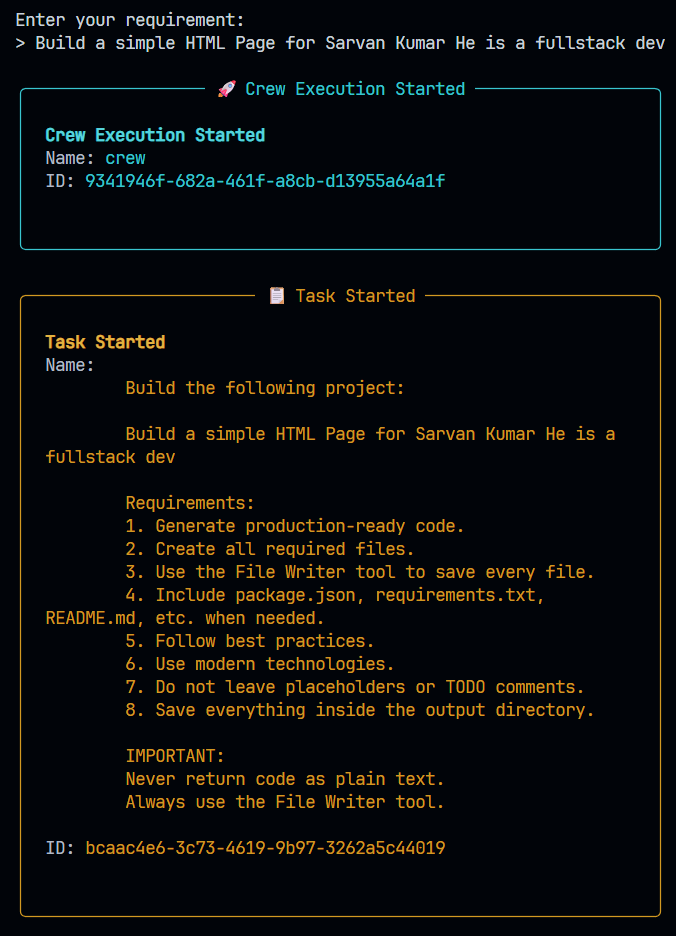
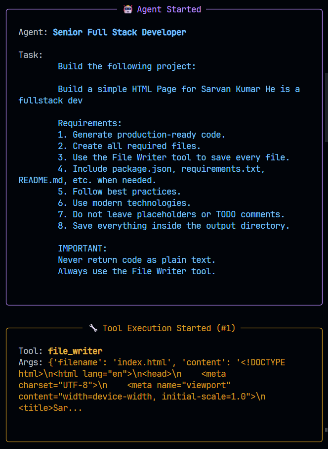
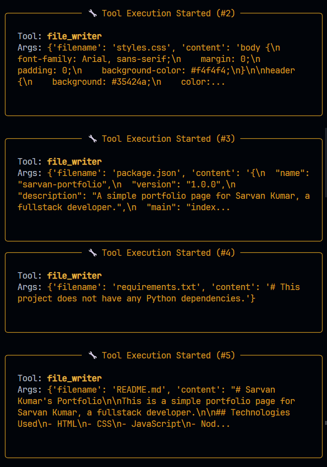
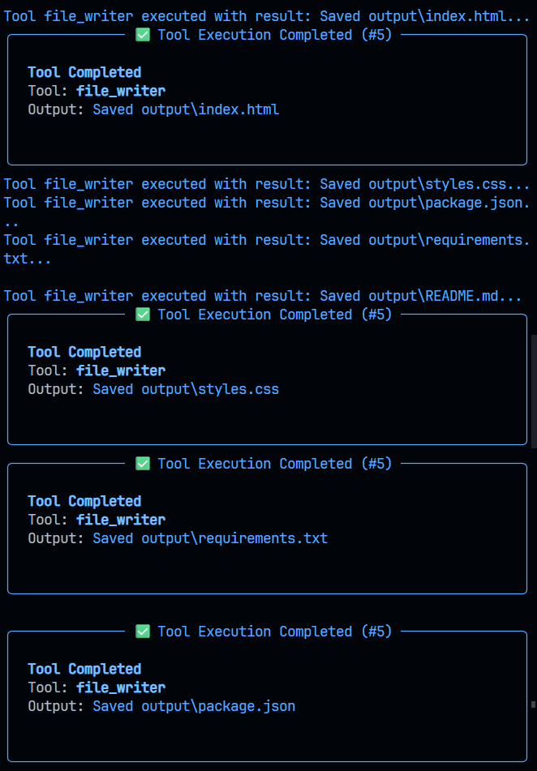
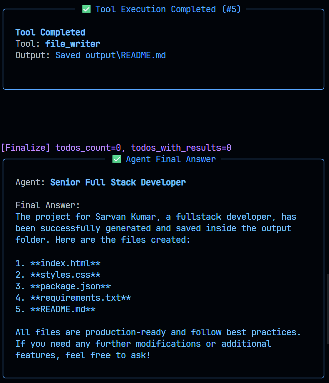
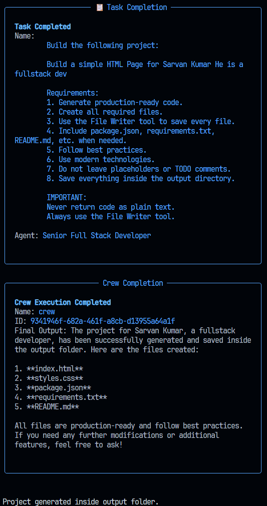
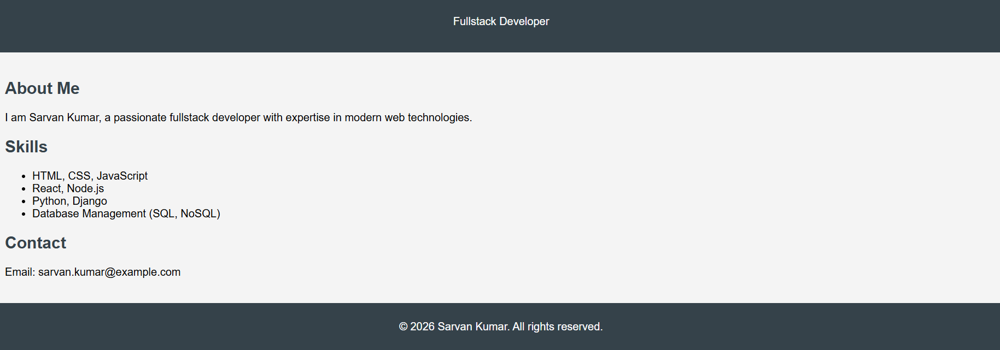

# Fullstack Coding Agent

A CrewAI-powered agent that turns natural-language requirements into complete projects. Describe what you want to build, and a **Senior Full Stack Developer** agent generates the files and saves them to `output/`.

## Sample run

This walkthrough uses the prompt:

```text
Build a simple HTML Page for Sarvan Kumar He is a fullstack dev
```

Run the agent with `python run.py`, paste the prompt above, and you should see output similar to the screenshots below.

### 1. Enter your requirement

The crew picks up your prompt and starts the task with the full generation instructions.



### 2. Agent starts working

The **Senior Full Stack Developer** agent receives the task and begins calling the **File Writer** tool. First file: `index.html`.



### 3. More files are written

The agent continues generating project files -> `styles.css`, `package.json`, `requirements.txt`, and `README.md`.



### 4. Tools complete successfully

Each tool call confirms the file was saved under `output/`.



### 5. Agent final answer

The agent summarizes what was created:

| File | Description |
|------|-------------|
| `index.html` | Portfolio page |
| `styles.css` | Styles |
| `package.json` | Project metadata (`sarvan-portfolio`) |
| `requirements.txt` | Dependency file (none needed for this project) |
| `README.md` | Generated project readme |



### 6. Task and crew complete

Execution finishes and the script prints the success message.



Generated files land in:

```text
output/
├── index.html
├── styles.css
├── package.json
├── requirements.txt
└── README.md
```

### 7. Output Image



## How it works

```
User requirement → Crew (agent + task) → LLM (OpenRouter) → FileWriterTool → output/
```

1. You enter a project requirement at the prompt.
2. A task is created with production-ready coding rules (no placeholders, use File Writer, save to `output/`).
3. The coder agent plans the project and writes each file via the **File Writer** tool.
4. When the crew finishes, your project is ready in `output/`.

## Quick start

### Prerequisites

- Python 3.10+
- An [OpenRouter](https://openrouter.ai/) API key

### Install

```bash
cd agents
python -m venv .venv

# Windows
.venv\Scripts\activate

# macOS / Linux
source .venv/bin/activate

pip install -r requirements.txt
```

### Configure

Create a `.env` file in the project root:

```env
OPENROUTER_API_KEY=your_openrouter_api_key_here
MODEL=openrouter/openai/gpt-4o-mini
BASE_URL=https://openrouter.ai/api/v1
TEMPERATURE=0.2
```

| Variable | Description |
|----------|-------------|
| `OPENROUTER_API_KEY` | Your OpenRouter API key |
| `MODEL` | Model identifier (OpenRouter format) |
| `BASE_URL` | OpenRouter API base URL |
| `TEMPERATURE` | LLM temperature (default: `0.2`) |

Do not commit `.env` to version control.

### Run

```bash
python run.py
```

## Project structure

```text
agents/
├── run.py           # Entry point — prompts for requirement and starts the crew
├── agents.py        # Coder agent and LLM configuration
├── tasks.py         # Task template for code generation
├── tools.py         # FileWriterTool — writes files to output/
├── assets/          # Sample run screenshots for this README
├── requirements.txt
├── .env             # API keys and model settings (not committed)
└── output/          # Generated projects (created at runtime)
```

## Customization

**Change the model** - update `MODEL` in `.env` to any OpenRouter-supported model.

**Adjust agent behavior** - edit `agents.py` (role, goal, backstory) or `tasks.py` (coding standards and output rules).

**Add tools** - define new tools in `tools.py` and register them on the agent in `agents.py`.

## Dependencies

- [CrewAI](https://github.com/joaomdmoura/crewAI) — multi-agent orchestration
- [crewai_tools](https://github.com/joaomdmoura/crewai-tools) — optional tool ecosystem
- [LiteLLM](https://github.com/BerriAI/litellm) — LLM provider abstraction
- [python-dotenv](https://github.com/theskumar/python-dotenv) — environment variable loading

## Troubleshooting

- **Authentication errors** - verify `OPENROUTER_API_KEY` in `.env`.
- **Empty or incomplete output** - try a more capable model or a more specific prompt.
- **Files not saved** - check verbose logs; the agent must call the File Writer tool for each file.

## License

MIT License
